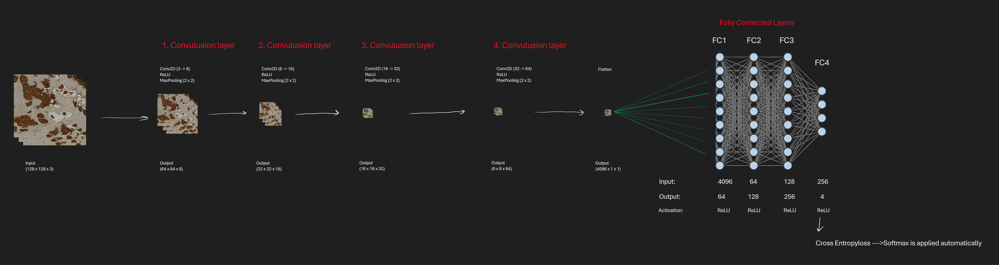

# Custom-CNN-HER2-Scoring 🔬🧠

In this project, a custom Convolutional Neural Network (CNN) model was developed from scratch to classify HER2 scores using the Breast Cancer Immunohistochemical (BCI) dataset.

## 🚀 Project Overview

- ✅ Dataset used: This dataset was part of a course assignment and cannot be shared publicly  
- ✅ Classes: `0`, `1+`, `2+`, `3+`  
- ✅ Image resolution: Originally `1024x1024x3`, resized to `128x128x3`  
- ✅ Libraries: PyTorch, torchvision, sklearn, TensorBoard

## 📊 Model Architecture

The CNN model is fully custom-defined and consists of the following layers:

- 4 blocks of Conv2D + ReLU + MaxPooling  
- Flatten layer  
- 3 Fully Connected layers with ReLU activation  
- Final output layer (4-class classification)

Model architecture is illustrated below:

## 📈 Training Process

- Epochs: 200  
- Loss Function: CrossEntropyLoss  
- Optimizer: Adam (learning rate: 0.001)  
- TensorBoard used for visualizing loss and accuracy  
- Final Validation Accuracy ~ 61%

## 🧪 Results

- Classification accuracy: around 61%  
- Confusion matrix and class-based performance scores included  
- Overfitting observed and addressed with relevant suggestions

## 🔍 Observations

- Imbalanced dataset caused uneven performance across classes  
- Training accuracy increased sharply, while validation accuracy plateaued → Overfitting detected  
- Suggested improvements: Data Augmentation, Dropout, BatchNorm, EarlyStopping

## 📁 Project Files

- `DeepLearning.ipynb`: Full training & testing script  
- `best_model.pt`: Best model weights (saved)  
- `runs/`: TensorBoard logs  
- `README.md`: This documentation

## 📝 Note

This work was developed strictly for educational purposes.  
The CNN architecture was implemented from scratch without using any pretrained or library-imported models (e.g., ResNet, VGG, etc.).

---

# Custom-CNN-HER2-Scoring 🔬🧠

Bu projede, Breast Cancer Immunohistochemical (BCI) veri seti kullanılarak HER2 skorlarının sınıflandırılması amacıyla sıfırdan bir Convolutional Neural Network (CNN) modeli tasarlanmıştır.

## 🚀 Proje Özeti

- ✅ Kullanılan veri seti: Ödev olarak yaptığım ve dataset bana ait olmadığı için paylaşamıyorum  
- ✅ Sınıflar: `0`, `1+`, `2+`, `3+`  
- ✅ Görüntü boyutu: `1024x1024x3` → `128x128x3` olarak yeniden boyutlandırıldı  
- ✅ Kullanılan kütüphaneler: PyTorch, torchvision, sklearn, TensorBoard

## 📊 Model Mimarisi

CNN modeli sıfırdan tanımlanmış olup aşağıdaki katmanlardan oluşur:

- 4 adet Conv2D + ReLU + MaxPool bloğu  
- Flatten  
- 3 adet Fully Connected katman (ReLU aktivasyonlu)  
- Sonuç katmanı (4 sınıf için)

Model mimarisi görsel olarak şöyle gösterilmiştir:

## 📈 Eğitim Süreci

- Epoch: 200  
- Loss Function: CrossEntropyLoss  
- Optimizer: Adam (lr=0.001)  
- TensorBoard ile loss ve accuracy izleme yapılmıştır  
- Validation Accuracy ~ %61

## 🧪 Sonuçlar

- Accuracy: %61 civarında  
- Confusion Matrix ve sınıf bazlı başarı skorları eklenmiştir  
- Overfitting tespiti yapılmış, çözüm önerileri sunulmuştur

## 🔍 Gözlemler

- Dengesiz veri dağılımı sonucu sınıflarda farklı başarı oranları gözlemlenmiştir  
- Eğitim setinde yüksek doğruluk, validation setinde sabit doğruluk → Overfitting problemi  
- İyileştirme için: Data Augmentation, Dropout, BatchNorm, EarlyStopping önerilmiştir

## 📁 Proje Dosyaları

- `DeepLearning.ipynb`: Eğitim & test kodları  
- `best_model.pt`: En iyi model ağırlıkları  
- `runs/`: TensorBoard kayıtları  
- `README.md`: Bu açıklama dosyası

## 📝 Not

Bu çalışma tamamen eğitim amaçlı hazırlanmıştır. Model, hazır CNN kütüphaneleri kullanmadan sıfırdan yazılmıştır.

